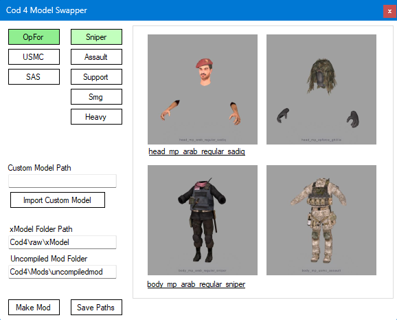
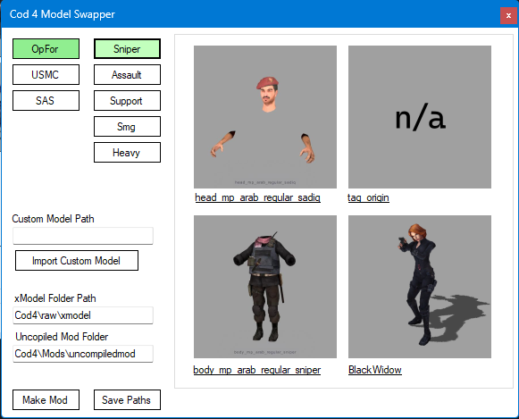
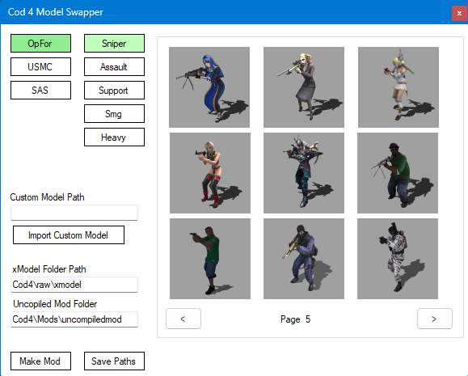

<h1 align="center">
   
  Cod 4 Model Changer
   
</h1>

  

  

  
<h4 align="center">
    You need cod4 mod tools: <a href="https://github.com/promod/CoD4-Mod-Tools/tree/master">Cod4 Mod Tools</a>
    Your mod needs to be uncompiled.
    Once you choose a model to replace and choose the target it will change the xmodel in the mod's folder and add the model you wish to replace in the mod.csv
</h4>
  

  

  

  

<h4 align="center">
    Currently, you can only target OPFor and USMC (SAS Button does nothing)
</h4>
